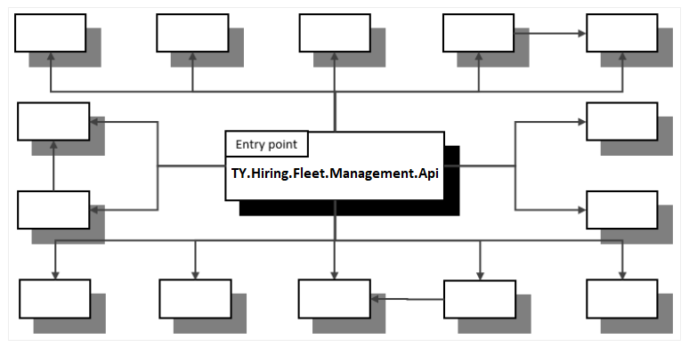
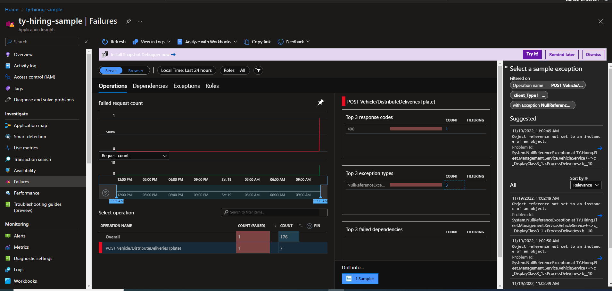

## Project Document

#### Basics

The project was developed using dotnet 6. It is designed as a backend web api. The database is decided from the settings file. If "HostEnv" value is "dev" it uses EF Core Inmemory db, if "test" it uses Sqllite db, MsSql db for "preprod" and "prod". The current setting is "test". InMemory is for development purposes only, as it does not support db transactions. Test data is saved to the relevant database via EF when the application is first run.

The application is serving at [ty-hiring-sample.azurewebsites.net](https://ty-hiring-sample.azurewebsites.net/swagger/index.html)

#### Architecture

The application consists of 8 assemblies.

* **TY.Hiring.Fleet.Management.Api** => It is the entry point of the application. It is positioned as "Composition root". Services are registered in this layer. 
* **TY.Hiring.Fleet.Management.AppConfig** => This layer encapsulates the Application settings. Also all layers consume settings through this project.
* **TY.Hiring.Fleet.Management.Data.ORM.EF** => It is the data and data access layer. The database context is here. EF is used as ORM in this layer.
* **TY.Hiring.Fleet.Management.Mapper** => This layer contains AutoMapper profiles. It is positioned as a separate project as it is used by both the test and the "composition root".
* **TY.Hiring.Fleet.Management.Model** => There are transfer objects, enums, classes that do not have a state, which are used in the application.
* **TY.Hiring.Fleet.Management.Service** => Service layer. Business logic is run here.
* **TY.Hiring.Fleet.Management.Service.Interface** => Here are the interfaces of the service layer. 
* **TY.Hiring.Fleet.Management.UnitTest** => Unit test layer. It is built using the nunit library. 

#### Intermaediate Elements

##### Exception Handling

Error catching is done only in the api layer. In case of errors in other layers, it is sent up to this API layer. With the "ExceptionHandlerMiddleware" in the API layer, the error is caught, logged and no details are given to the end user. In this way, error management can be done from a single point.

##### Logging

There are 2 logging logics. One is aplication business logs other is system (exception) logs. 

###### Business log

We can call it logging of operational errors. It is the log created for the package that was loaded incorrectly in the vehicle. It is created and listed through LogService.

###### System log

These are the logs created in case of an error or according to the needs of the team developing the system. Logging is done via ILogger in Dotnet 6. The storage location is determined by the setting made or by the location where the application is hosted. For example, in Azure, we can follow the logs instantly under the "Application Insight" resource.

